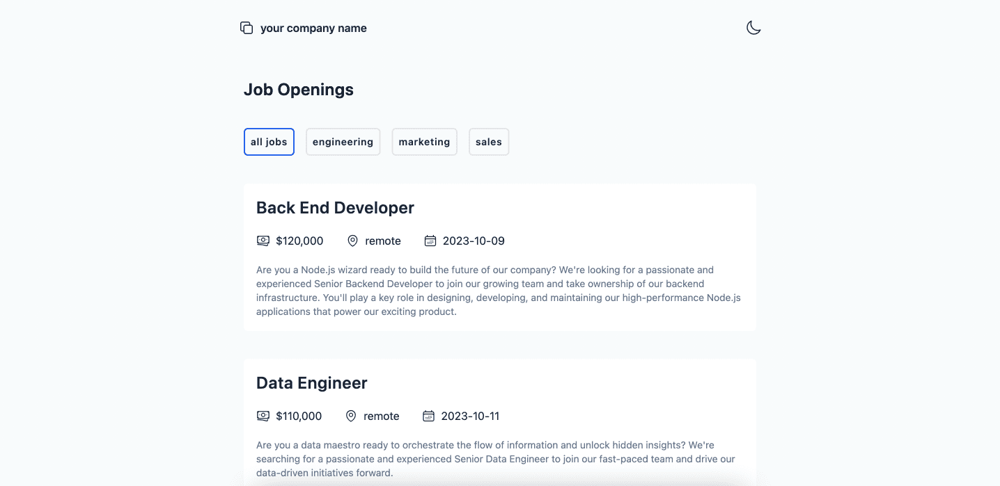

# Jobs Board



## 🛠 Project Tech

- [astro](https://astro.build/)
- [tailwindcss](https://tailwindcss.com/)

## 🚀 Project Structure

```text
/
├── public/
├── src/
│   └── components/
│   └── content/
│   └── layouts/
│   └── pages/
│       └── jobs/
│           └── department
│       └── index.astro
```

All job data comes from markdown files under the `content` folder. all jobs are fetched and displayed in `index.astro`.
Clicking on a job card will you to jobs detail page (`pages/jobs/[...slug.astro]`)

## 🧞 Commands

All commands are run from the root of the project, from a terminal:

| Command                   | Action                                           |
| :------------------------ | :----------------------------------------------- |
| `npm install`             | Installs dependencies                            |
| `npm run dev`             | Starts local dev server at `localhost:4321`      |
| `npm run build`           | Build your production site to `./dist/`          |
| `npm run preview`         | Preview your build locally, before deploying     |
| `npm run astro ...`       | Run CLI commands like `astro add`, `astro check` |
| `npm run astro -- --help` | Get help using the Astro CLI                     |
